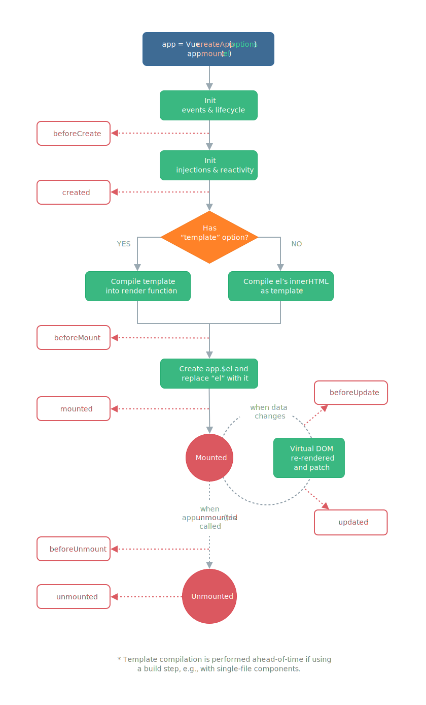

# Components

<h2 style='color: #42b983'>Methods</h2>

The methods of the component are declared in the methods property. They can then be called from an expression in the template or from another method of the component with `this.myMethod()`

Example: [**Methods Folder** ](/src/components/components-example/methods)

<h2 style='color: #42b983'>Computed and Watchers</h2>

It is common to want to place within your templates some data that can be directly deduced from other data, or formatted in a certain way. While it is possible to put any JavaScript expression in a directive, a good practice is to limit template complexity and code duplication by declaring computed properties in the component's computed option .

A computed property is a property that can be computed directly and synchronously from other available properties (either props, data or other computed properties). This is similar to a getter, but it is also possible to specify a setter for a computed property. Vue will identify the variables on which a computed property depends to set up the reactivity and update its value when one of its dependencies is mutated.

Vue also lets you declare observers that run some specific code when a property (prop, data, or computed) is mutated. We call this an observed property by a watcher. The observed properties are declared in the watch option of the component.

To distinguish the use cases of computed vs watcher, we will privilege most often the computed properties whenever possible. A watcher is more appropriate when what interests you in a mutation is not so much the new value, but the moment it occurs; to perform server requests or external actions for example.

Example: [**Computed & Watchers Folder** ](/src/components/components-example/computedAndWatchers)

<h2 style='color: #42b983'>Component Lifecycle</h2>

### **VUE 2**

### **VUE 3**

Each stage of the life cycle of a component calls two callback functions, one just before the framework does its internal work, and the other just after. These callbacks can be used to define a specific behavior for the component at these precise moments:

    export default {
        mounted() {
            console.log(This component has been mounted on the DOM, this.$el refers to the corresponding DOM element.); this.$el.querySelector("input").focus();
        }
    };

Typically, we use created as the equivalent of a constructor function, to initialize certain data or to make some HTTP requests. We use mounted when some initialization steps need to interact with the DOM. Finally, we use destroyed (or unmounted with Vue 3) to clean up when the component is no longer used, for example delete global event listeners to avoid memory leaks. Other callbacks are reserved for more specific use cases.

<h2 style='color: #42b983'>Communication Between Components</h2>

### **Parent to Child communication with props**

Like any other HTML element, Vue components can receive arguments, called props or properties. Props are used to convey information from a parent component to a child component.

You must declare the list of accepted properties in the props option of the component. Received props can be used in templates or methods just like properties declared in data. The difference is that we will avoid reassigning or mutating props: since these values come from the parent component, we must rather communicate with this parent (ascending communication) for it to make the change itself. The changed value will then be automatically reported to the child components.

Example: [**Parent to child Folder** ](/src/components/components-example/communication/parentToChild)
